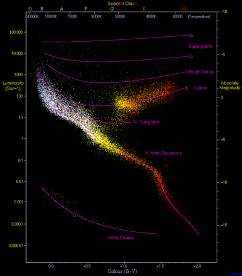

```{r setup, include=FALSE}
knitr::opts_chunk$set(echo = TRUE)
```
```{r results='hide', message=FALSE, warning=FALSE}
library(vcdExtra)
library(ggplot2)
library(bayesm)
library(reshape2)
library(dplyr)
library(flexmix)
library(extracat)
library(nnet)
```

#Chapter 4, Question 5

```{r}
#5.a
ggplot(data=Yamaguchi87,aes(x=Son,y=Freq))+geom_bar(stat='identity')+facet_wrap(~Country)+ ggtitle("Sons' Occupation comparison in US, UK and Japan")

#5.b
Yamaguchi87_tidy <- melt(Yamaguchi87, id=c("Country","Freq"))
ggplot(data=Yamaguchi87_tidy[Yamaguchi87$Country=='UK',],aes(x=value,y=Freq))+geom_bar(stat='identity')+facet_wrap(~variable)+ggtitle("Occupation comparison of sons and fathers in UK")

```

(a) The distribution of occupations of Sons is somewhat similar in US and UK. It follows similar pattern in both countries except for the UpNM category. Japan looks completely different from US and UK.
(b) We see that sons' occupation is more skewed towards Non Manual job (especially UpNM). It can be said that sons usually move towards white collar jobs (NM). We also see more fathers in farming and manual occupations.
(c) The results are what I expected. With modernization more people move towards white collar jobs which we can clearly see happening here.

# Chapter 4, Question 6
```{r}

data(Scotch)
per_brand=array(dim=21)
for (i in 1:21){
  per_brand[i]=sum(Scotch[,i])
}
data=matrix(nrow=1,ncol=2)
data=data.frame(data)
colnames(data)=c("Brand","Responders")
for (i in 1:21){
  data[i,1]=colnames(Scotch)[i]
  data[i,2]=per_brand[i]
}

brand_orderdesc <- data %>% arrange(desc(Responders))
data1=data
data1$Brand<-factor(data1$Brand,levels=brand_orderdesc$Brand)
ggplot(data=data,aes(x=Brand,y=Responders))+geom_bar(stat='identity')+ coord_flip()+ggtitle("Number of responders for each brand")

#6 (b)
Others=data[1:10,]
Others$Brand[10]="Others"
Others$Responders[10]=sum(data$Responders[10:length(data$Responders)])
brand_orderdesc1 <- Others %>% arrange(desc(Responders))
data2=Others
data2$Brand<-factor(Others$Brand,levels=brand_orderdesc1$Brand)
ggplot(data=data2,aes(x=Brand,y=Responders))+geom_bar(stat='identity')+ coord_flip()+ggtitle("Number of responders for each brand with small brands grouped")

#6 (c)
data(whiskey)
write.csv(whiskey_brands,"whiskey_brands.csv")
write.csv(data1,"responders.csv")
#Putting whiskey brands data in responders dataset. Used excel for this because the names werent exactly same in both datasets.
library(readr)
responders <- read_csv("G:/Acads/EDAV/responders_extra.csv", 
    col_types = cols(X1 = col_skip()))

responders1<-responders[-6,]
brand_orderdesc2 <- responders1 %>% arrange(desc(Responders))
data3=responders1
data3$Brand<-factor(responders1$Brand,levels=brand_orderdesc2$Brand)

ggplot(data=data3,aes(x=Brand,y=Responders,fill=Type))+geom_bar(stat='identity')+ coord_flip()+ggtitle("Number of responders for each brand")
ggplot(data=data3,aes(x=Brand,y=Responders,fill=Bottled))+geom_bar(stat='identity')+ coord_flip()+ggtitle("Number of responders for each brand")


```

(a) I think it is best to order the brands by their number of respondents. It becomes easier to find a relationship between two brands.
(b) Other brands could be defined as the ones having significantly low res ponders. We can see that the number of res ponders drop drastically for Pinch Haig and after that. __Pinch Haig has 117__ respondents. Hence, we can use this as cut-off to define big and small brands.
(c) The two plots show the type and bottled location of the brands.
(d) Would call it __Whisky__ because the major brands in this dataset are foreign where the 'Whisky' spelling is used. 'Wishkey' is used in US and lot of these brands are Scottish who use 'Whisky'. Assuming that the dataset is from USA.

#Chapter 5, Question 8
```{r}
data(olives)
olives=olives

#Plotting scatter plots of 4 variables at a time so that the plots are readable
plot(olives[,3:6],pch=1)
plot(olives[,c(3,4,7,8)],pch=1)
plot(olives[,c(3,4,9,10)],pch=1)
plot(olives[,c(5,6,7,8)],pch=1)
plot(olives[,c(5,6,9,10)],pch=1)
plot(olives[,c(7,8,9,10)],pch=1)

plot(olives[,3:10],pch=1)

```

Plotting scatter plots of 4 variables at a time so that the plots are readable.

(a) 
__Strong positive association:__ palmitic & pamitoleic, palmitic & linoleic, pamitoleic & linoleic.
Arachidic and eicosenic also show some positive association. But, there are many data-points where value for eicosenic is low (1 to 3) for different values of arachidic. Same is true for Linolenic and eicoseoic.

__Strong negative association:__ palmitic & oleic, pamitoleic & oleic,oleic and linoeic.

(b) __Outliers and other features:__ Palmitic has one outlier which can be clearly seen. Stearic also has some outliers. Linolenic and eicosenoic have a couple of outliers on the higher side.
Many of the fatty acids have high occurrences of low value and these low values are spread across for different values of other fatty acids. This leads to a clearly standing out groups of points which form a straight line parallel to X/Y-axis depending on which axis these fatty acids are plotted on. Linolenic, eicosenoic and arachidic show such characteristic.

#Chapter 5, Question 10

```{r}
library(GDAdata)
#data(HRstars)
HRstars=HRstars
HRstars$V1=HRstars$V+5*(1+log10(HRstars$Para))
plot(HRstars$BV,HRstars$V1)
plot(HRstars$BV,-HRstars$V1)
```

(a) The plots look similar to each other on flipping the values of V in data. But, the points are not so well separated as can be seen in the original HR plot.
(b) The stars for which we don't have appropriate data or are unable to get the correct data, are less likely to be used.
(c) We can clearly see three distinct groups of stars in the plot. We can color them differently by modifying the data appropriately. We can also add legends to explain what each of the group is. We can reduce the size of dots to make it more readable. 

#Chapter 6, Question 5

```{r}
load("C:/Users/Abhay Pawar/Downloads/wine.rda")
load("C:/Users/Abhay Pawar/Downloads/bodyfat.rda")
bodyfat1=bodyfat

for (i in 1:length(colnames(bodyfat1))){
  max=max(bodyfat1[,i])
  min=min(bodyfat1[,i])
  bodyfat1[,i]=(bodyfat1[,i]-min)/(max-min)
}

bodyfat1$id=0*bodyfat1$bodyfat
for (i in 1:length(bodyfat1$bodyfat)){
  bodyfat1$id[i]=i
}
bodyfat_tidy <- melt(bodyfat1, id=c("id"))
ggplot(bodyfat_tidy, aes(variable, value, group = id,color=variable)) + 
    geom_line()
ggplot(bodyfat_tidy[bodyfat_tidy$variable=="height" | bodyfat_tidy$variable=="bodyfat",], aes(variable, value, group = id,color=variable)) + 
    geom_line()

plot(bodyfat1$height,bodyfat1$bodyfat)
plot(bodyfat1$height)

plot(bodyfat1$density,bodyfat1$bodyfat)


```

The PCP is a scaled parallel coordinate plot.
(a) There are many outliers on both sides (Value=0 and value=1). We can also see some individuals consistently having extreme values. Eg. We see a line at 1 from neck to knee which is a same person. We see similar individuals with value=0 for many parameters.

(b) On plotting the parallel coordinate plot for bodyfat and height, we can see that there is not much correlation between these. Same can be seen from the scatter plot of the two variables. There are also a couple of records with zero/very low height which is unlikely.

(c) Density and bodyfat have high negative correlation. We can clearly see that individuals with low density have high body fat and vice-verse. Same can be seen more clearly from the scatter plot.

(d) The ordering makes it difficult to make much sense out of the data. For the purpose of building a multiple linear regression model, they could be ordered on the basis of how correlated the variables are with bodyfat. They could also be ordered from head to toe to clearly visualize which body parts matter more.


#Chapter 6, Question 7
```{r}
wine1=wine
wine1$classdigit=as.numeric(wine1$classdigit)
for (i in 1:14){
  max=max(wine1[,i])
  min=min(wine1[,i])
  wine1[,i]=(wine1[,i]-min)/(max-min)
}
for (i in 1:length(wine1$Alcohol)){
  wine1$id[i]=i
}
# Plotting inidividual pcp for each variable so that it can be read well
wine_tidy <- melt(wine1, id=c("id"))
ggplot(wine_tidy[wine_tidy$variable!="class",], aes(variable, value, group = id,color=variable)) + geom_line()+ scale_y_discrete(breaks=c("0","0.5","1"))+coord_flip()

ggplot(wine_tidy[wine_tidy$variable=="classdigit" | wine_tidy$variable=="Alcohol",], aes(variable, value, group = id,color=variable)) + geom_line()+ scale_y_discrete(breaks=c("0","0.5","1"))

ggplot(wine_tidy[wine_tidy$variable=="classdigit" | wine_tidy$variable=="MalicAcid",], aes(variable, value, group = id,color=variable)) + geom_line()+ scale_y_discrete(breaks=c("0","0.5","1"))

ggplot(wine_tidy[wine_tidy$variable=="classdigit" | wine_tidy$variable=="Ash",], aes(variable, value, group = id,color=variable)) + geom_line()+ scale_y_discrete(breaks=c("0","0.5","1"))

ggplot(wine_tidy[wine_tidy$variable=="classdigit" | wine_tidy$variable=="AlcAsh",], aes(variable, value, group = id,color=variable)) + geom_line()+ scale_y_discrete(breaks=c("0","0.5","1"))

ggplot(wine_tidy[wine_tidy$variable=="classdigit" | wine_tidy$variable=="Mg",], aes(variable, value, group = id,color=variable)) + geom_line()+ scale_y_discrete(breaks=c("0","0.5","1"))

ggplot(wine_tidy[wine_tidy$variable=="classdigit" | wine_tidy$variable=="Phenols",], aes(variable, value, group = id,color=variable)) + geom_line()+ scale_y_discrete(breaks=c("0","0.5","1"))

ggplot(wine_tidy[wine_tidy$variable=="classdigit" | wine_tidy$variable=="Flav",], aes(variable, value, group = id,color=variable)) + geom_line()+ scale_y_discrete(breaks=c("0","0.5","1"))

ggplot(wine_tidy[wine_tidy$variable=="classdigit" | wine_tidy$variable=="NonFlavPhenols",], aes(variable, value, group = id,color=variable)) + geom_line()+ scale_y_discrete(breaks=c("0","0.5","1"))

ggplot(wine_tidy[wine_tidy$variable=="classdigit" | wine_tidy$variable=="Proa",], aes(variable, value, group = id,color=variable)) + geom_line()+ scale_y_discrete(breaks=c("0","0.5","1"))

ggplot(wine_tidy[wine_tidy$variable=="classdigit" | wine_tidy$variable=="Color",], aes(variable, value, group = id,color=variable)) + geom_line()+ scale_y_discrete(breaks=c("0","0.5","1"))

ggplot(wine_tidy[wine_tidy$variable=="classdigit" | wine_tidy$variable=="Hue",], aes(variable, value, group = id,color=variable)) + geom_line()+ scale_y_discrete(breaks=c("0","0.5","1"))

ggplot(wine_tidy[wine_tidy$variable=="classdigit" | wine_tidy$variable=="OD",], aes(variable, value, group = id,color=variable)) + geom_line()+ scale_y_discrete(breaks=c("0","0.5","1"))

ggplot(wine_tidy[wine_tidy$variable=="classdigit" | wine_tidy$variable=="Proline",], aes(variable, value, group = id,color=variable)) + geom_line()+ scale_y_discrete(breaks=c("0","0.5","1"))

```

Plotted the PCP individually for each variable so that they are readable
(a) We can infer if the variables separate the classes by looking at PCP and seeing if the lines for the three classes originate from/lead to different values of a variable. Eg. for variable Flav, we can see that for class=3 (value=1 in the PCP), Flav values are on the lower side. For class=1, the values are on the higher side and for class=2 they tend to lie in the middle. There are very few variables which separate all the three classes well. There are some variables which separate two of the three classes well. Following are those variables:

__separate all three classes:__ Flav, Color

__Only separate class 1 and 2:__ Alcohol, Proline

__Only separate class 1 and 3:__ AlcAsh, Phenols, Proa, Hue, OD, Proline

__Only separate class 3 and 2:__ Alcohol

(b) Yes, there are many outliers which can be seen from the lines originating from values close to 1 and 0. These lines stand out by their own and hence, are outliers.

(c) Yes, there is evidence of subgroups within classes. This can be seen from the individual PCP for all variables. Some variables take wide range of values for all classes and hence, can't separate them well. Thus, we can form subgroups within classes based on the value of such variables.

##Part 2
#Dataset 1: Whiskey
```{r}
data(Scotch)
brands_consumed=array(dim=length(Scotch[,1]))
for (i in 1:length(brands_consumed)){
  brands_consumed[i]=sum(Scotch[i,])
}

Scotch1=Scotch
Scotch1$brands_consumed=brands_consumed
hist(Scotch1$brands_consumed,breaks=20)

```

This histogram shows how many brands a single user bought. We see that people usually buy the same brand. I did more analysis on this below.

```{r message=FALSE, warning=FALSE}

library(arules)
Scotch1=Scotch
for (i in 1:length(colnames(Scotch))){
  Scotch1[,i]=as.logical(Scotch[,i])
}
rules <- apriori(Scotch1,parameter = list(supp=0.01,conf=0.1,minlen=2,maxlen=2))
#inspect(rules)
#Copied the rules into excel sheet and imported the data
library(readr)
association <- read_csv("G:/Acads/EDAV/association.csv")
#View(association)
ggplot(data=association,aes(Brand1,Brand2,color=conf))+geom_point()+theme(axis.text.x = element_text(angle = 90, hjust = 1))

```

This plot shows how different brands are associated with each other. The intensities of the dots show the confidence for the pair.

Confidence = Prob(Brand on Y axis was bought| Brand on X axis was bought)

Confidence tells the likelihood of a person buying Brand on Y axis given that he bought the brand on X axis. Dark blue implies low association and hence, the brands not being bought by the same people. Opposite is true for Light blue.
We can clearly see group of brands emerging from this.

__{Glenlivet, Glenfidditch, Knockonda}__: These brands have high association within themselves and have low association with all other brands. Interesting thing is all these are single malts, implying customers sticking to a single type of whiskey (in this case single malt) rather than a single brand. We can add __Macallan__ as well to this group due to high association. And interestingly, it also a single malt. 

__Chivas Regal__: When we look at Chivas Regal on Y-axis, we see high associations with lot of brands. This implies that customer who buy any kind of whiskey, frequently buy Chivas Regal as well. But, the opposite is not true. People who buy Chivas Regal(On X axis), stick to Chivas Regal. Chivas Regal could probably be a brand which has a wide audience and a strong following from certain people who stick to it.

__Johnnie Walker(both brands), J&B, Black&White__ can also be said to be forming a group.

#Dataset 2: Wine

```{r}
wine1=wine
for (i in 1:13){
  max=max(wine1[,i])
  min=min(wine1[,i])
  wine1[,i]=(wine1[,i]-min)/(max-min)
}

wine2<-wine1[,-c(ncol(wine1))]

# Plotting inidividual pcp for each variable so that it can be read well
wine_tidy <- melt(wine2, id=c("classdigit"))
ggplot() + geom_boxplot(data=wine_tidy, aes(y=value,x=1,color=classdigit)) + scale_y_discrete(breaks=c("0","0.5","1"))+facet_wrap(~variable)

```

This plot visualizes the boxplot of the variable value for the three classes. As compared to PCP, this is a lot easier way to visually tell which variables separate the classes well. Good thing about boxplot for this task is that we can ignore the outliers. But, in PCP it is difficult to make out outliers if there are too many of them. 

__Separate all three classes:__ Phenols, Flav, Color, NonFlavPhenols, Alcohol

__Only separate class 1 and 2:__ Proline, Ash, Mg

__Only separate class 1 and 3:__ Malic Acid, AlcAsh, Proa, Hue, OD, Proline

__Only separate class 3 and 2:__ Malic Acid, Hue, OD


Above list is based on comparing if the middle 50% range overlaps for two different classes. I am more confident about this list than the one we got using PCP because PCP is very difficult to read. We also have some new variables in this list as compared to the one we got from PCP.

I then built a model using the 5 variables which could separate all the three classes well and got an __accuracy of 94%__. We can also say that these boxplots have helped us in heuristically finding out important variables and using them for the model. On using five of the less predictive variables, the accuracy drops to 84%


```{r}
library(nnet)
wine$prog2 <- relevel(wine$classdigit, ref = 1)
test <- multinom(prog2 ~ Phenols + Flav+Color + NonFlavPhenols + Alcohol, data = wine)
#summary(test)

wine_pred=wine
predictions=predict(test, newdata = wine_pred, "probs")

for (i in 1:length(predictions[,1])){
  max=max(predictions[i,])
  for (j in 1:3){
    if (max==predictions[i,j]){
      wine_pred$pred[i]=j
    }
  }
}

sum=0
wine_pred$classdigit=as.numeric(wine_pred$classdigit)
for (i in 1:length(predictions[,1])){
  if (wine_pred$classdigit[i]==wine_pred$pred[i]){
    sum=sum+1
  }
}


Accuracy1=sum/length(predictions[,1])


#Malic Acid, AlcAsh, Proa, Hue, OD, Proline, Ash Mg
test <- multinom(prog2 ~ MalicAcid+ AlcAsh+ Proa+ Hue+ OD, data = wine)
#summary(test)

wine_pred=wine
predictions=predict(test, newdata = wine_pred, "probs")

for (i in 1:length(predictions[,1])){
  max=max(predictions[i,])
  for (j in 1:3){
    if (max==predictions[i,j]){
      wine_pred$pred[i]=j
    }
  }
}

sum=0
wine_pred$classdigit=as.numeric(wine_pred$classdigit)
for (i in 1:length(predictions[,1])){
  if (wine_pred$classdigit[i]==wine_pred$pred[i]){
    sum=sum+1
  }
}

Accuracy2=sum/length(predictions[,1])

Variables=c('High Predictive Variables','Low Predictive Variables')
Accuracy=c(Accuracy1,Accuracy2)
data_acc=data.frame(Variables,Accuracy)

ggplot(data=data_acc,aes(Variables,Accuracy,fill=Variables))+geom_bar(stat='identity')
```


